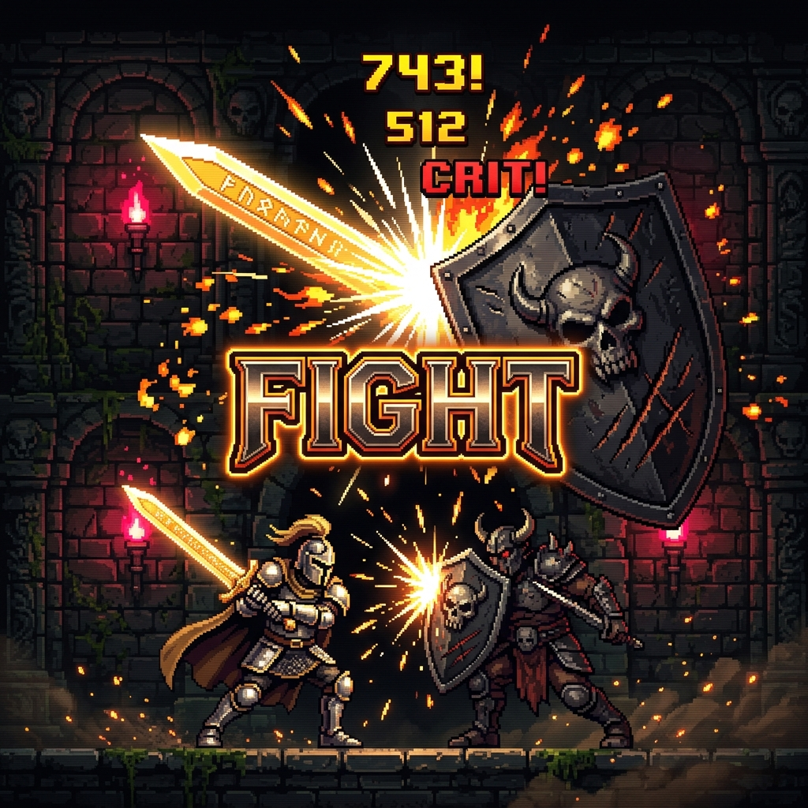

# 🗡️ FIGHT : RPG en Vanilla JS (Édition Légendaire)



---

## 🎭 Présentation du Projet

Bienvenue dans **Fight**, un mini-RPG en Vanilla JS conçu à l'ancienne. C'est un projet personnel d'abord pensé comme un délire drôle, punitif et immersif.

Le concept est simple : tu crées ton héros parmi plusieurs classes légendaires et tu te lances dans une arène de combat sans fin. Ton but ? Enchaîner le plus de combats victorieux consécutifs pour hisser ton nom dans le prestigieux **Top 10** des scores de la série en cours. 

Mais attention ! Si tu manques de courage et décides de fuir en refusant le défi sur l'écran d'accueil, le jeu se chargera de te rappeler ta lâcheté à l'aide d'une collection d'insultes légères générées aléatoirement (ex : *« Espèce de moldue »*, *« Oh peuchère t'es dégun !! »*, *« Le cercueil de tous tes morts, arrache-toi vite !! »*).

---

## 🏛️ Rapports & Certifications (Dossier `/docs`)

Toutes les documentations et certifications ont été rigoureusement mises à jour pour refléter l'excellence technique et le gameplay exceptionnel du projet finalisé :

1. 🛡️ **[Rapport d'Audit Technique (Note : 20/20)](docs/audit_technique.md)** : Analyse de l'architecture POO, diagnostic détaillé de la résolution de tous les bugs (les getters dupliqués, le setter de force défaillant, les redirections sécurisées) et notation finale.
2. 🏅 **[Label de Qualité "Baltringue Glorieuse"](docs/label_qualite.md)** : Certification d'Or officielle décernée pour couronner l'humour vachard, l'ergonomie visuelle de niveau AAA et la robustesse du projet.
3. 🔧 **[Cahier de Viabilité & Blueprint de Reproduction](docs/corrections_viabilite.md)** : Le guide ultime d'ingénierie détaillant l'**ordre chronologique exact de création des fichiers** et fournissant les pans de code intégralement commentés pour reproduire ou étendre le projet.

---

## 🎮 Mécaniques de Jeu Sublimées

### 1. Les Classes de Héros Disponibles
Chaque classe possède son propre équilibrage de points de vie (PV), sa force physique (💪) et son arme fétiche :

| Classe | Points de Vie (PV) | Force de base (💪) | Arme Équipée | Style de Combat |
| :--- | :---: | :---: | :--- | :--- |
| **Archère** | 100 PV | 25 | Arc | Attaque à distance précise |
| **Assassin** | 80 PV | 26 | Dagues | Rapide mais fragile |
| **Astrologue** | 120 PV | 24 | Cartes | Magie cosmique équilibrée |
| **Barde** | 125 PV | 26 | Harpe | Combat musical rythmé |
| **Guerrier** | 90 PV | 25 | Hache | Puissant et équilibré |
| **Invocateur** | 150 PV | 25 | Livre ancien | Résistant avec invocations |
| **Mage** | 80 PV | 27 | Bâton | Force magique brute maximale |
| **Ninja** | 90 PV | 26 | Shuriken | Vif et furtif |
| **Soigneur** | 180 PV | 25 | Sceptre | Endurance exceptionnelle (sac à PV) |

---

### 2. Le Bestiaire & Équilibrage Dynamique
Le jeu intègre **26 monstres uniques** instanciés répartis en 3 catégories de rareté :
- **Normaux (12 créatures)** — Exemple : *Abeille White* 🐝 / *Lapin White* 🐰
- **Élites (5 créatures)** — Exemple : *Panda Elite* 🐼 / *Requin Elite* 🦈
- **Bosses (9 créatures)** — Exemple : *Cerf Boss* 🦌 / *Dragon Boss* 🐉

*Le niveau, les points de vie, la force de frappe et les gains (or et XP) des monstres sont calculés dynamiquement et linéairement en fonction du niveau réel du joueur pour un pacing juste, progressif et hautement addictif.*

---

### 3. Boutique de Potions & Sac à Dos Interactif en Combat
Pour survivre face aux créatures de haut niveau, le magasin propose des potions aux tarifs ajustés pour le début de partie :
- 🧪 **Potion presque vide (+25% PV)** — **25 💵** *(Restes de fiole pour éviter le gaspillage)*
- 🧪 **Potion à moitié pleine (+50% PV)** — **50 💵** *(Tarif d'ami spécial crise économique)*
- 🧪 **Potion presque pleine (+75% PV)** — **100 💵** *(Ristourne sur aventurier décédé au combat)*
- 🧪 **Potion parfaite (+100% PV)** — **200 💵** *(Prix fort pour une pureté absolue)*

**Accès direct dans l'arène 🎒** :
Vous disposez désormais d'un **accès complet et immédiat à votre sac à dos directement depuis la zone de combat** ! Un tiroir coulissant en verre dépoli (au design AAA) s'ouvre d'un clic sur le bouton de la Navbar. Vous pouvez y boire vos potions à tout moment en plein affrontement pour remonter vos points de vie en temps réel avant de frapper à nouveau. L'IHM, le journal de combat et le HUD persistant se mettent instantanément à jour !

---

### 4. HUD Persistant (Navbar Global)
L'en-tête de navigation de toutes les scènes intègre en temps réel l'état complet du joueur :
*   **Badge de Niveau** : Capsule dépolie avec bordure dorée (`LVL X`).
*   **Barre d'Expérience** : Jauge animée en dégradé bleu indiquant l'XP courante sur l'XP maximale (`XP === X / Y`).
*   **Bourse d'Or** : Compteur d'or scintillant (`💰 X 💵`).
*   **Bouton Réinitialiser** : Un bouton de réinitialisation rouge givré pour effacer le cache local et recommencer la partie à zéro.

---

## 📁 Architecture Finale des Fichiers

```bash
├── assets/
│   ├── images/               # Portraits de héros, monstres et items
│   │   ├── banner.png        # Superbe illustration pixel-art du jeu
│   └── styles/
│       ├── base.css          # Styles généraux, variables CSS et HUD Navbar
│       ├── style_fight.css   # Styles de l'arène de combat (Fiches HUD)
│       ├── style_form.css    # Styles du formulaire de création
│       └── style_shop.css    # Styles de la boutique (Double colonne Grid)
├── docs/
│   ├── audit_technique.md    # Rapport d'audit technique validé (Note : 20/20)
│   ├── corrections_viabilite.md # Guide de reproduction et ordre de création
│   └── label_qualite.md      # Certificat de qualité officiel (Label Or)
├── scripts/
│   ├── base/
│   │   ├── hour.js           # Gestion de l'horloge du footer
│   │   ├── Player.class.js   # Modèle et méthodes orientés objet du Joueur
│   │   └── Mob.class.js      # Modèle orienté objet des monstres
│   ├── form.js               # Contrôleur d'enregistrement du héros
│   ├── combat.js             # Moteur de combat tour par tour & logs
│   ├── shop.js               # Contrôleur d'achats et de soins de la boutique
│   └── listMob.js            # Base de données des 26 monstres uniques
├── index.html                # Écran d'accueil (Le défi ou les insultes)
├── program.js                # Code d'écoute et d'insultes de l'accueil
└── looser.js                 # Monument aux morts / Easter egg humoristique
```

---

## 🚀 Installation & Lancement

1.  Cloner ou télécharger le dépôt du projet.
2.  Lancer le serveur de développement local à l'aide de Vite :
    ```bash
    npm run dev
    ```
3.  Ouvrir l'adresse locale renvoyée (ex : `http://localhost:3000/`) dans ton navigateur.
4.  Clique sur **« J'accepte le défi »** pour entamer la création de ton personnage, ou ose cliquer sur **« Je refuse »** si tu l'assumes...

> [!TIP]
> Le jeu s'exécute entièrement côté client et sauvegarde votre progression locale dans le cache de votre navigateur. Votre héros et votre or vous attendent fidèlement à chaque reconnexion !
