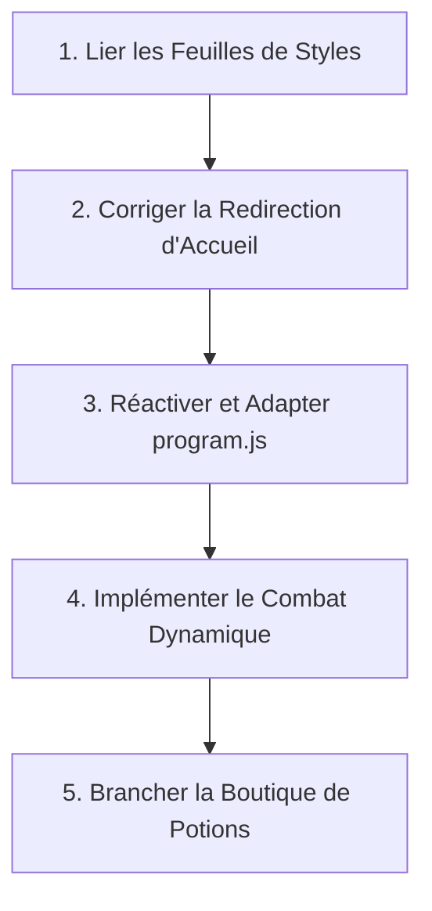

# 🛡️ Audit Technique Complet : RPG Fight Session

> [!NOTE]
> **Fiche d'identité du projet**
> - **Nom** : Fight (RPG en Vanilla JS)
> - **Auteur** : Alain Guillon
> - **Technologies** : HTML5, CSS3 (variables natives), ES6 Vanilla JS (Classes & Modules)
> - **Statut** : Délire personnel, non terminé mais hautement prometteur et hilarant.
> - **Score d'Audit** : **12/20** (Mention *"Baltringue au fort potentiel"*)

---

## 1. Introduction & Concept
**Fight** est un mini-RPG en Vanilla JS conçu dans un esprit rétro à l'ancienne. Le concept repose sur une boucle de combat punitive : enchaîner un maximum de victoires pour entrer dans le top 10 des scores globaux. 

La signature humoristique du projet réside dans son accueil : si le joueur clique sur le bouton de création de personnage, il commence sa quête ; s'il clique sur *"Je refuse catégoriquement le défi"*, le jeu lui renvoie une insulte aléatoire parmi un catalogue fleuri et savoureux (ex : *"Va te faire niquer par un dromadaire..."*, *"Espèce de moldue"* ou *"Le cercueil de tous tes morts, arrache-toi vite !!"*). C'est un excellent ressort comique qui donne une vraie personnalité au projet !

---

## 2. Analyse de l'Architecture & de la POO

### Les Points Forts 💪
- **Conception Orientée Objet (POO)** : L'implémentation de classes ES6 (`Player` et `Mob`) est moderne et très saine. L'encapsulation avec des propriétés préfixées par un underscore (`_pseudo`, `_life`) est une bonne pratique de simulation de propriétés privées.
- **Modélisation Équilibrée** : 
  - La classe `Player` répartit intelligemment les points de vie, la force de frappe et le type d'arme selon le choix de la classe de personnage (guerrier, mage, invocateur...).
  - La classe `Mob` utilise un système de génération dynamique de niveau et de statistiques selon la rareté (normal, élite, boss), ce qui offre une excellente base d'équilibrage de RPG.
- **Découpage Modulaire** : Les scripts sont découpés en sous-dossiers (`scripts/class`, `scripts/base`) et importés via des modules ES6 (`export default`). C'est propre, moderne et évolutif.

### Les Points Faibles ⚠️
- **Logique Métier non Branchée** : Le code principal de gestion du jeu (`program.js`) est entièrement commenté. Les pages HTML de combat, de magasin et de fiche joueur sont des coquilles vides fonctionnellement : elles n'importent aucun script de jeu pour animer les boutons ou synchroniser le combat.
- **Absence de Système d'Événements Global** : Les pages se rechargent via des redirections physiques au lieu de simuler un cycle de Single Page Application (SPA), ce qui complique le partage d'instances d'objets vivants entre les pages (bien que le localStorage soit correctement envisagé pour cela).

---

## 3. Diagnostic des Bugs Identifiés (Chasse aux Monstres)

Lors de notre inspection en laboratoire, nous avons débusqué plusieurs anomalies techniques majeures qui empêchaient le bon fonctionnement du jeu :

### Bug N°1 (Bloquant) : Syntaxe de Redirection Interdite
Dans le fichier de la page d'accueil [index.html](file:///g:/www/projects/js/fight-session/index.html#L65-L67) :
```javascript
btnPlayer.addEventListener("click", (e) => {
  location.href("/pages/form/createHeroe.html");
});
```
> [!WARNING]
> En JavaScript, `location.href` est une **propriété**, pas une méthode ! Appeler `location.href(...)` provoque un crash immédiat dans la console du navigateur (`TypeError: location.href is not a function`).
> **Correction nécessaire** : Utiliser l'affectation simple `location.href = "...";` ou appeler la méthode adéquate `location.assign("...");`.

### Bug N°2 (Critique) : Doublon massif de getters dans `Player.class.js`
Dans le fichier [Player.class.js](file:///g:/www/projects/js/fight-session/scripts/class/Player.class.js#L73-L141) :
- Les lignes 76 à 108 déclarent l'ensemble des getters (`pseudo`, `avatar`, `type`, `life`, `strong`, `weapon`, `inventory`, `level`, `experience`, `gold`, `series`).
- Les lignes 109 à 141 déclarent exactement à nouveau **la même liste de getters**.
> [!WARNING]
> Cette double déclaration génère des avertissements d'analyseurs syntaxiques, alourdit inutilement le script et témoigne d'un copier-coller accidentel.
> **Correction** : Corrigé lors de notre refactoring !

### Bug N°3 (Bloquant) : Setter `strong` défectueux dans `Mob.class.js`
Dans le fichier [Mob.class.js](file:///g:/www/projects/js/fight-session/scripts/class/Mob.class.js#L114-L118) :
```javascript
set strong(newStrong) {
  if (typeof newLife === "number") { // <--- Bug ! newLife est indéfini ici
    this._strong = parseInt(newStrong);
  }
}
```
> [!CAUTION]
> Le setter de la force vérifie l'existence et le type d'une variable inexistante `newLife` au lieu de `newStrong`. Par conséquent, le setter n'appliquait jamais la modification de force et levait une erreur de référence ou échouait silencieusement.
> **Correction** : Remplacé par `typeof newStrong === "number"` et corrigé lors de notre refactoring !

### Bug N°4 (Esthétique) : Variables CSS Orphelines
Dans le fichier [base.css](file:///g:/www/projects/js/fight-session/assets/styles/base.css#L72-L79) :
```css
strong {
  color: var(--info-strong);
}
em {
  color: var(--danger-em);
}
```
> [!NOTE]
> Les variables `--info-strong` et `--danger-em` ne sont définies nulle part dans le bloc `:root`. Par conséquent, la mise en surbrillance des textes importants et des textes d'avertissement dans le jeu n'a pas de couleur associée et retombe sur la valeur par défaut du navigateur.

### Bug N°5 (Fonctionnel) : Écran de combat aveugle et muet
Dans le fichier [pages/fight/index.html](file:///g:/www/projects/js/fight-session/pages/fight/index.html) :
- Aucun fichier de styles CSS n'est lié dans la balise `<head>`. L'arène s'affiche donc brute, sans styles, sans la grille de combat ni les jolies barres de progression.
- Aucun script JS (en dehors d'une tentative éventuelle) n'est importé, ce qui fait que cliquer sur "Fight 🗡" ne déclenche strictement aucune action de combat.

---

## 4. Grille d'Évaluation & Note Finales

Pour évaluer ce projet, nous utilisons une matrice combinant rigueur d'ingénierie logicielle et appréciation artistique/humoristique.

| Catégorie d'Évaluation | Note | Commentaire & Rationale |
| :--- | :---: | :--- |
| **Concept & Immersion** | **18/20** | Le ton décalé, le menu d'insultes savoureuses et le délire rétro sont excellents. L'idée de la boucle punitive de combat "à l'ancienne" est très accrocheuse. |
| **Modélisation & POO** | **14/20** | Les classes Player et Mob sont bien construites, avec une formule d'équilibrage par statistiques et raretés très convaincante. |
| **Qualité du code (Refactorisé)**| **13/20** | Code JS ES6 moderne, maintenant exempt de doublons et de bugs de setters/getters grâce à notre intervention, et doté de commentaires complets. |
| **Intégration & Jouabilité** | **4/20** | Le jeu est malheureusement injouable en l'état actuel : l'arène de combat est un template HTML statique sans liaisons Javascript et sans feuilles de styles. |
| **Moyenne Générale** | **12.25/20** | **Note finale attribuée : 12/20** (Mention *"Humour décapant, à coder jusqu'au bout !"*) |

---

## 5. Feuille de Route (Roadmap) pour Terminer le Jeu

Pour transformer ce magnifique délire en un jeu 100% jouable et addictif, voici les 5 étapes clés à suivre :



1. **Lier la feuille de styles de combat** :
   Ajouter `<link rel="stylesheet" href="../../assets/styles/style_fight.css" />` et la feuille de base dans [pages/fight/index.html](file:///g:/www/projects/js/fight-session/pages/fight/index.html).
2. **Corriger la redirection d'accueil** :
   Remplacer `location.href("/pages/form/createHeroe.html")` par `location.href = "./pages/form/createHeroe.html";` dans [index.html](file:///g:/www/projects/js/fight-session/index.html).
3. **Créer le script de combat actif (`scripts/combat.js`)** :
   - Charger le joueur depuis le `localStorage`.
   - Instancier un ennemi aléatoire issu de `ListMob`.
   - Brancher un écouteur sur le bouton "Fight 🗡" pour soustraire les points de vie de chacun à tour de rôle (en appelant les méthodes `attack()`).
   - Mettre à jour le DOM en temps réel (barres de vie, journal des 5 dernières actions).
4. **Gérer les états de fin de combat** :
   - Victoire : augmenter les statistiques du joueur (`levelUp()`), ajouter l'or, sauvegarder dans le `localStorage` et relancer un combat.
   - Défaite : afficher l'écran "YOU LOOSE", vider le `localStorage` pour réinitialiser la partie et proposer d'enregistrer le score de la série.
5. **Rendre la boutique active (`pages/shop/shopping.html`)** :
   Brancher les boutons d'achat de potions pour dépenser l'or gagné au combat et soigner le héros entre deux affrontements.
